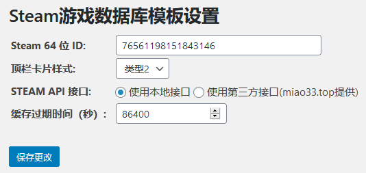

# Steam 游戏库 WordPress 插件

## 功能

本插件注册了一个页面模板，用于展示 Steam 游戏库。

## 使用方法
1. 上传并启用插件
2. 在`后台`->`Steam游戏库`中填写对应的账户与配置信息
    
3. 新建页面，页面模板选择`Steam库`
4. 保存页面，前台预览

## TODO

1. 后台主动清空缓存
2. 补充模板内原文输出方法

## 声明

1. 本插件版权归属于`菜鸟生物圈（Noob-Biosphere）`所有。
2. 未经许可，不得将本插件`API`文件夹下的任意内容集成至任何第三方项目。

## 关于菜鸟生物圈（Noob-Biosphere）

`菜鸟生物圈（Noob-Biosphere）`基于 Github 组织功能建立，是一个包含（且仅包含）代码开发、技术共享的兴趣组织。

`菜鸟生物圈（Noob-Biosphere）`是一个自由组织，其不承担对成员行为负责的义务，其成员也不承担对本组织负责的义务。