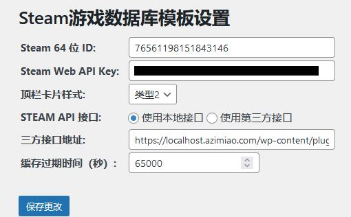
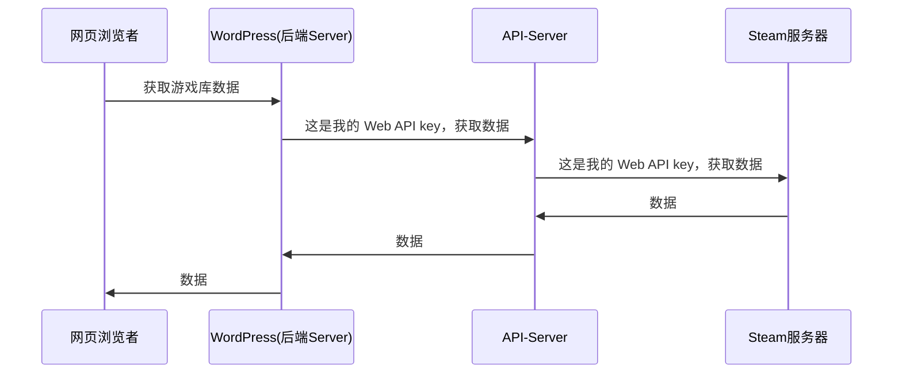

# Steam 游戏库 WordPress 插件

## 功能

本插件注册了一个页面模板，用于展示 Steam 游戏库。

## 使用方法
1. 拉取本仓库所有文件，包括**子模块**:`git clone --recursive`。
2. 上传并启用插件
3. 在`后台`->`Steam游戏库`中填写对应的账户与配置信息 
4. 新建页面，页面模板选择`Steam库`
5. 保存页面，前台预览

## 信息安全说明

目前使用的 Steam API 需要 Web API key，请访问：`https://steamcommunity.com/dev/apikey`申请。

原则上，前台用户看不到 Web API key，API Key 由 Server 持有，不对前台访问者暴露。

但是，Web API 依旧可能因如下原因泄漏：

- Web API 可能因本插件漏洞、WordPress 漏洞等而泄漏
- 当访问三方 API-Server 或通过 CDN 访问 API-Server 时，您的 Web Key 会暴露给三方 API 运营者或 CDN 服务商

本插件未经过安全审计，受限于个人水平，请自行承担 Web API 泄漏之责任。

## TODO

1. 后台主动清空缓存

## 声明

1. 本插件版权归属于`菜鸟生物圈（Noob-Biosphere）`所有。
2. 未经许可，不得将本插件`API`文件夹下的任意内容集成至任何第三方项目。

## 关于菜鸟生物圈（Noob-Biosphere）

`菜鸟生物圈（Noob-Biosphere）`基于 Github 组织功能建立，是一个包含（且仅包含）代码开发、技术共享的兴趣组织。

`菜鸟生物圈（Noob-Biosphere）`是一个自由组织，其不承担对成员行为负责的义务，其成员也不承担对本组织负责的义务。
